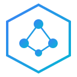

<p align="center">
  
</p>

<h1 align="center">kafkats</h1>

<p align="center">
  A TypeScript Kafka client and streaming library.
</p>

<p align="center">
  <a href="https://www.npmjs.com/package/@kafkats/client"></a>
  <a href="https://github.com/chrisrecalis/kafkats/actions"></a>
  <a href="https://github.com/chrisrecalis/kafkats/blob/main/LICENSE"></a>
</p>

<p align="center">
  <a href="https://chrisrecalis.github.io/kafkats"><strong>Documentation</strong></a>
</p>

## Packages

| Package | Description |
|---------|-------------|
| `@kafkats/client` | Kafka client with producer, consumer, and admin APIs |
| `@kafkats/flow` | Kafka Streams-like DSL for stream processing |
| `@kafkats/flow-state-lmdb` | Persistent LMDB state stores |
| `@kafkats/codec-zod` | Zod schema validation codecs |

## Quick Start

```bash
npm install @kafkats/client
```

```typescript
import { KafkaClient } from '@kafkats/client'

const client = new KafkaClient({ brokers: ['localhost:9092'] })

// Producer
const producer = client.producer()
await producer.send('events', [{ key: 'user-1', value: 'hello' }])

// Consumer
const consumer = client.consumer({ groupId: 'my-group' })
await consumer.runEach('events', async (message, ctx) => {
  console.log(message.value?.toString())
})
```

## License

MIT
